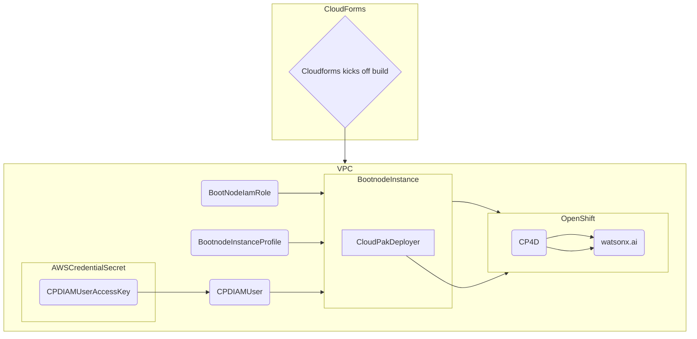

# Architecture

## Architecture Decisions

As of this time AWS ROSA is not certified for Watsonx.ai, but will be in sometime in 2024.

For now we recommend the following:

- User managed Openshift in AWS
- Cloud Pak for Data with the following components
    - watsonx assistant
    - Watson Discovery
    - OpenPages
    - watsonx.ai
    - Watson Studio
    - Watson Machine Learning
    - IBM Knowledge Catalog 
- Foundational Models
    - mixtral-8x7b-instruct-v01-q
    - llama2
    - ibm-granite-chat-v2.1

## Bill of Materials

### Foundational Model requirements for watsonx.ai

One of the following types of GPUs is required to support the use of foundation models in IBM watsonx.ai:

- NVIDIA A100 80 GB
- NVIDIA H100 80 GB
- NVIDIA L40S 48 GB

Currently this the A100 GPU are available in the P4 flavor ec2 instance in AWS.

### AWS Requirements

#### Infrastructure

|Flavor | Count | vCPU | RAM | GPU Count | GPU RAM | Local Storage |
|--|--|--|--|--|--|--|
|m5.2xlarge|3|24 (8 cores x Count)|96G (32G x Count)|0|0| 300Gb |
|m6i.8xlarge|6|192 (32 cores x Count)|768G (128G x Count)|0|0| 500Gb |
|p4d.24xlarge|1|96|1152G|8|320G| 500Gb |
|**Totals**|13|336|2112G|8|320G| 3500Gb |

#### Networking

- 1x VPC
- 3x AZ
- 1x NLB
- 1x ALB

## Deployment in Action

- CloudFormation Template

The cloudformation template can be found [here](/Cloudformation/cluster.yml)

The following is an approximate diagram of how the CloudFormation template operates. It creates the IAM roles, VPC, Users, and a bootnode from which it deploys OCP and Cloud Pak for Data with `cloud-pak-deployer`.

A variation of the cloudformation template that uses STS for auth can be found [here](/Cloudformation/cluster-sts.yml)

## watsonx.ai on AWS

<iframe
  title="Watsonx.ai-AWS-update"
  width="825"
  height="720"
  src="https://app.terrastruct.com/diagrams/550782635">
</iframe>

<iframe width="768" height="432" src="https://miro.com/app/embed/uXjVNtCvNTw=/?pres=1&frameId=3458764578922854387&embedId=518034396865" frameborder="0" scrolling="no" allow="fullscreen; clipboard-read; clipboard-write" allowfullscreen></iframe>