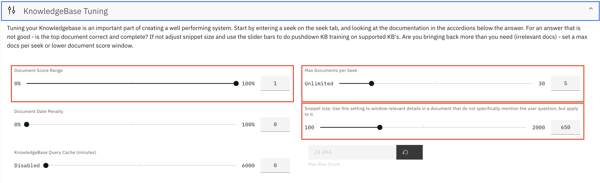
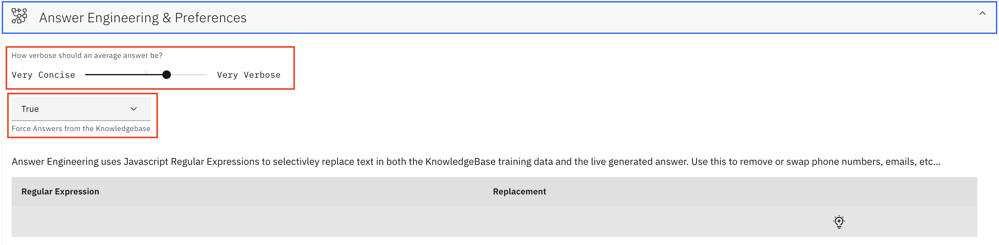
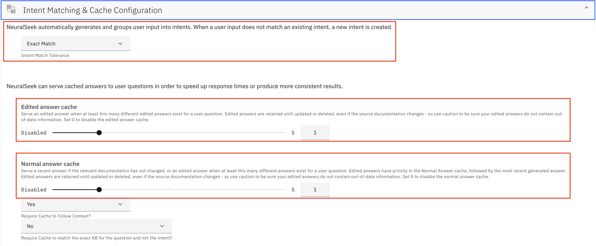

### Set Up
1. Once you've opened NeuralSeek, you'll land on the "Configure" tab. 
1. Enter the name of the company or organization that NeuralSeek will be generating answers for. Click "Next"

### KnowledgeBase Connection
1. Input Watson Discovery KnowledgeBase details. Discovery API Key and Discovery Service URL can be found on the Watson Discovery service instance page. Once you have created a project and a collection in Watson Discovery, the Discovery Project ID can be found on the integration tab under API Information. Once you fill out the KnowledgeBase Connection details, test the connection by clicking "Test". Once tested, click "Next". The button will turn green when it successfully connects to Watson Discovery.

1. For Virtual Agent Type, select "Watson Assistant Type". Click "Next". Click "Next". 


### LLM Details
In the LLM Details, you must add at least one LLM. If you choose to add multiple, NeuralSeek will load-balance across them for the selected functions that have multiple LLM's.
For API key, there are two options: SaaS and CP4D. You only need to fill out one or the other. Ensure your endpoint and project id are accurate.


In this case, we are interested in CP4D. The CP4D api key must be a base64 encoded key, and it can be found using the terminal comamnd below. You can generate 'myapikey' by clicking on the profile picture on the top right hand corner and then clicking 'Generate new key'.
```
printf "myusername:myapikey" | base64
```

You can confirm if you succeeded in connecting with your zenapikey by using the curl command below:
```
curl -H "Authorization: ZenApiKey ${TOKEN}" "https://<cpd_instance_route>/<endpoint>"
```

Credentials from watsonx.ai that you need for LLM details:
First make sure you have a project created within watsonx.ai.
- LLM Endpoint
    - Go to [WatsonX Platform](https://dataplatform.cloud.ibm.com/wx/home?context=wx)
    - Prompt Lab -> View code (Right hand side, to the right of Model) -> Copy the API endpoint after `curl`
- LLM Project ID: 
    - Go to [WatsonX Platform](https://dataplatform.cloud.ibm.com/wx/home?context=wx)
    - Projects -> Manage -> General -> Details -> Project ID

## Configuration & Tuning
Please see below for recommended settings:
- Knowledge Base Tuning:
    - Set score range to 100%
    - Set snippet size to 650
    

- Answer Engineering & Preferences
    - Change conciseness from tier 2 on the bar to tier 3
    

- Intent Matching & Cache Configuration
    - Select Exact Match for Intent Match Tolerance
    - Edited Answer Cache set to 1
    - Normal Answer Cache set to 1
    - Require Cache to Follow Context? set to Yes
    - Require Cache to match the exact KB for the question and not the intent? set to No
    

- Governance & Guardrails
    - Click "Semantic Model Tuning" and change Source Jump Penalty from 3 to 6. Source Jump penalty: When answers join across many source documents it can be an indication of lost meaning or intent, depending on your source documentation.
    
    
    - Turn on "Check document titles as part of the Semantic Match"
    - Turn on "Check document URL's as part of the Semantic Match"
    - Turn on "Remove sentences containing hallucinated key words"
    
    - Change minimum confidence to 5% and include a message to decrease risk of hallucinations
    

## Testing
-  Navigate to "Seek" tab. Test NeuralSeek with questions that are relevant to your documents, e.g. "What products or services do you offer?" You will be able to see the NeuralSeek answer with response details, metrics, and source.


Ensure to clear session turn if starting a new session by clicking on the red reset icon:


In addition to testing on NeuralSeek, we have written a script to allow testing through API for more flexibility.
We performed Pre-Processing and No OCR, No Pre-Processing and No OCR, and OCR experiments using the testing notebook.
You can and run the different experiments just by changing the Discovery collection ID and providing with the questions and expected responses as string arrays.
It uses the NeuralSeek API.
Please refer to [Testing Notebook](Tables Testing.ipynb) for detailed steps.

## Download Logs
- Proceed to API on Integrate tab

- Click Authorize, then paste in API key and then click authorize.


- Scroll to Logs section, click 'Try it out' and then click execute


- After execute, you can download logs in json format by clicking 'Download' 
