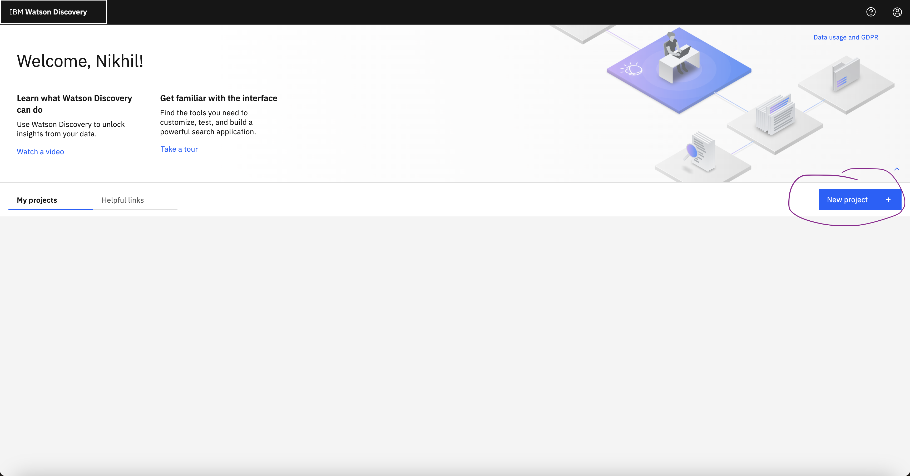

# Data Preprocessing

- Data containing tables needs to be pre-processed so that the LLM can properly read the content in tables. 
- Before uploading to watson discovery, run the following script on your files and upload the files generated by the output to Watson Discovery: [link](preprocess_file.ipynb)

# Create Project and Collection

  - First launch Watson Discovery and then, create a new project 
  - 
  - Select Conversational Search as the Project Type and upload your documents into the drop down:
  - 
  - If you will be web crawling your data, scroll down until you see the connect to data source option, click it and then select Web Crawl:
  - 

# Upload documents
  - Watson Discovery projects are organized by "collections" of documents. Documents can be queried at the project or individual collection level. 
  - Create the first project from a file upload and upload the knowledge base PDFs
