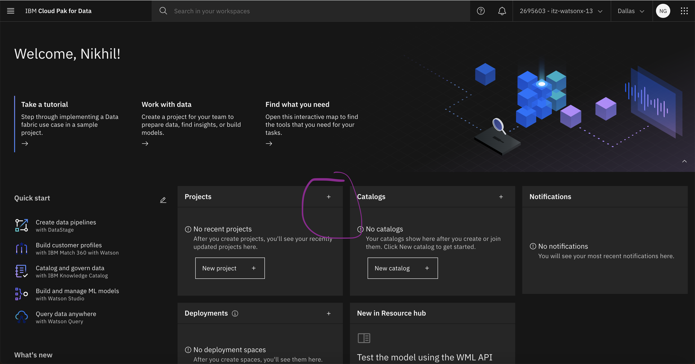
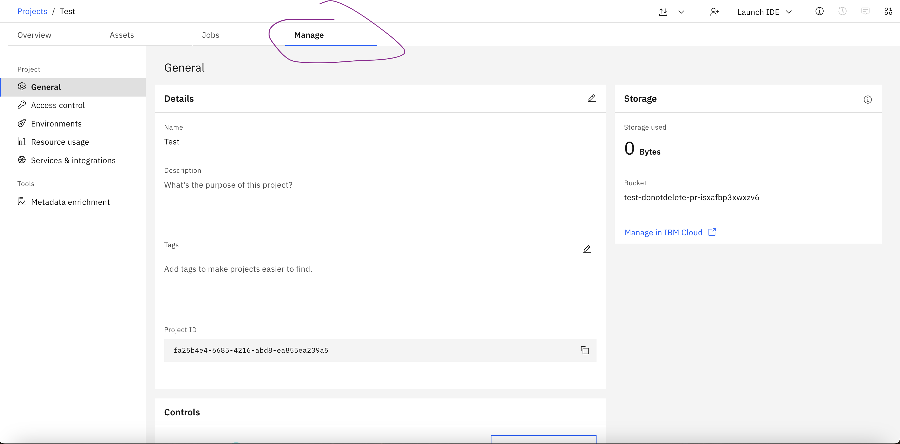
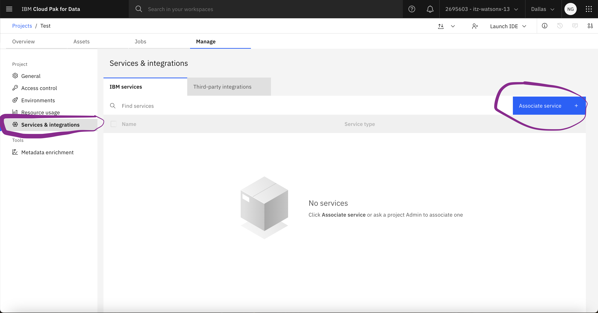
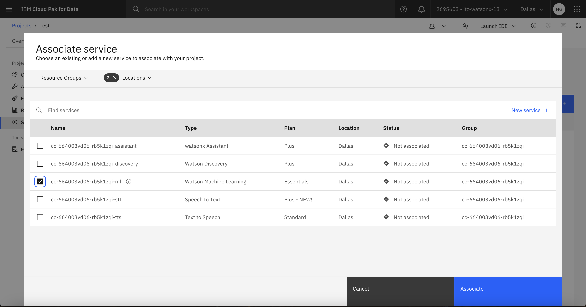

- Navigate to the Cloud Pak for Data homescreen and then create a project:
- 
- Once on the project home screen navigate to the manage tab. Note down the project id, you'll need this later when configuring NeuralSeek:
- 
- Next, associate a Watson Machine Learning Instance to your project. Navigate to the Services and Integrations tab and then click on Associate service:
- 
- Finally, check the Waston Machine Learning box to associate the instance to your project:
- 

