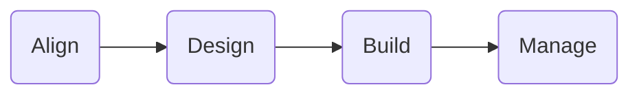

#### Flight Path
This is a living document for an adoption journey that synthesizes the best practices from IBM when considering and implementing a Gen AI Compliance Virtual Assistant using **`watsonx.ai`** on AWS.

The customer struggles internally with compliance fatigue as a company. With vast amounts of policy data, employees need help navigating and understanding policies, which results in ambiguity regarding the optimal course of action. Employees rely on internal SMEs to help resolve compliance and policy-related questions.  

Built on AWS, IBM’s Gen AI compliance assistant leverages a large language model (LLM) and Retrieval Augmented Generation technique to streamline access to important policy information. The assistant understands natural language queries and provides precise and contextually relevant answers based on internal documentation. This tool expedites information retrieval and ensures that all employees are consistently informed about the latest policies.  

#### Working In The Open

The Flight Path approach embodies IBM Client Engineering's dedication to transparency and collaboration, which is evident through the creation of this accessible repository that showcases real-life customer experiences. By sharing this knowledge, IBM aims to develop user-friendly and scalable landing zones that encourage the adoption of IBM Technology while prioritizing innovation and user experience. This repository represents IBM Client Engineering's commitment to working in the open, where stakeholders and interested parties can participate, provide feedback and benefit from collective knowledge.

:::info

IBM Client Engineering is a **no-cost** investment in IBM's customers to co-create and innovate leveraging IBM technology and methodologies. We partner with you to help you solve your business challenges. [Engage us today!](https://www.ibm.com/client-engineering)

:::

