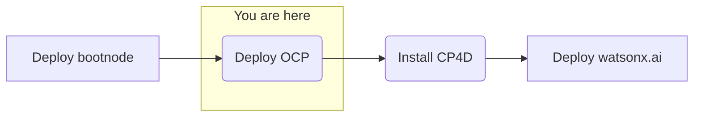

## Objective
Deploy watsonx.ai on self-managed AWS infrastructure for customer software evaluation

## Milestones
1. Deploy and configuration of boot node to establish a beach-head into the Fidelity AWS environment
    - Complete
2. Deploy OCP using the documented UPI installation steps
    - In progress
3. Install CloudPak for Data
4. Deploy and configure watsonx.ai on self-managed AWS infrastructure

## Today's Accomplishments
### AWS Deployment
- Configuration of the boot node
    - Installation of prerequisite software onto the boot node
    - Created and started local registry
    - Generated CA certrificate for PKI architecture
- Completion of step 1 of 2 of the deployment script

## Lessons Learned
- Storage insufficient on the bootnode for downloaded images, 400gb minimum required
    - Mitigation: We increased the boot disk size to 500 gig via the AWS console for the EC2 instance. We then grew the disk and grew the filesystem
    - This needs to be added as a prereq
- There was a constraint in the `sg-lb-template.yaml` requiring subnets sized from /16  o /24. We removed that constraint
- Edited `bootstrap-template.yaml` line 91 to remove the wrong key name. (artifact from testing)
- Software Evaluation process - define and build internal documentation - TBD
- Documentation updates
    - Parameter definitions - making them more descriptive
- Validation checks
    - Creating a vaalidation process before runniing any scripts/installs checking for prerequisites

## Decisions and Action Items (DAI)
- AWS CLI had a previous installation. Had to manually remove that installation and re-run the aws cli install command.
- We decided to run the installation as root user. Root user needed to have the `/usr/local/bin` added to the PATH. Did this manually on the fly with an `export` command.
-Customer security to approve selected AMI for coreOS
  - The AMI for CoreOS is a public AMI. The customer security team needs to copy it into the dev account as public AMI's are blocked in this environment
 
## Next Steps
- License and configure Cloud Pak for Data
    - Cloud Pak Considerations
        - Security scans needed on container images 
        - Customer has no OpenShift experience 
        - Customer requires on-prem, offline install
        - Customer uses their own container registry that might introduce extra effort or compatability issues 
        - Version compatibility with OpenShift (e.g. 4.10 required and customer has 4.11) 
        - Supported storage not available 
        - Multiple cloudpaks on the same cluster 
        - custom connections to data sources not supported OOTB 
        - AWS-specific: IAM users required for install/deploy and are not allowed 
        - OpenShift specific: CoreOS requirement for control nodes 
        - Automatic updating of Cloud Pak, this can interrupt engagements (solution is to always remove update polling from operators)
- Deploy watsonx.ai- Add `/usr/local/ in bin` to .bash`.bashrcd` for root