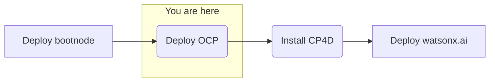

## Objective
Deploy watsonx.ai on self-managed AWS infrastructure forr customer software evaluation



## Milestones
1. Deploy and configuration of boot node to establish a beach-head into the Fidelity AWS environment
    - Complete
2. Deploy OCP using the documented UPI installation steps
    - In progress
3. Install CloudPak for Data
4. Deploy and configure watsonx.ai on self-managed AWS infrastructure

## Today's Accomplishments
- Verify ‘quay.io’ is the registry in config.sh
    - Verified in the registry
- Create a small instance on a different subnet, same VPC, and confirm that http://10.19.170.17:8080/test can be curled. Make require adjusting the Security Group rules for the bootnode. If 8080 fails, then HTTPD config will need be to changed to port 80 and service restarted
    - Initial onnectectivity over port 8080 failed
    - Fixed opoening port via security group
- Changed certificate organization (O) to match the domain
    - Cert validated vurrent certificate using output of `openssl x509 -in /ibm/security/certs/ca.crt -text -noout`
    
        ```
        Issuer: C = US, O = ec2.internal, CN = CA
        Subject: C = US, O = ec2.internal, CN = CA
        ```
    - Changed to

        ```
        Issuer: C = US, O = `customer domain name`, CN = CA
        Subject: C = US, O =  `customer domain name`, CN = CA
        ```
- Re-run step 1 script with required security tagging, as customer's security scans "remediated" improperly tagged items
- Depoyment script changes 
    - `gp2 -> gpt3`
- Renaming "bootnode" to bastion.'basedomain'
    - Renamed certificates to match
- Reran create registry command
- Reran DNS steps for new ELB
- Running Step 2 Script
    - First run failed - unable to find bootstrap
        ```
        Every Parameters object must contain a Type member
        An error occurred (ValidationError) when calling the DescribeStacks operation: Stack with id ibmwxai-6wvkv-bootstrap-stack does not exist
        ```
    - Solution - Needed to add Type string for parameter
        ```yaml
        BootstrapIgnitionLocation:
        Default: s3://my-s3-bucket/bootstrap.ign
        Description: Ignition config file location.
        Type: String ### This line was not here
        ```
    - Second run faled - same AMI issue
        - Customer security team unable to add public AMI access
    - Third run failed - new error
        - yaml validation on control plane stack
        `Parameter validation failed: parameter value for parameter name Master1Subnet does not exist. Rollback requested by user`
        - Investigating why script is not generating parameter for `Master1Subnet`
        - Typo found in script create_control_plane_param.sh - masters1ubnet -> master1subnet
    - Cleanup when step 2 script fails 
        - Remove metadata from wxai
        - Delete stacks created
    - Ignore FATAL error
    - Fourth run failed
        - Automated customer security scan "remediation" removed non-compliant security groups on bootstrap and master (Ingress and Egress)
           
            ```
            Security Event: Security Group with Unapproved Egress. The security group non-compliant egress rules have been deleted. Please check your application to ensure the functionality has not been negatively impacted.
            ```
            
            ```
            Security Event: Security Group with Unapproved Ingress. The security group non-compliant ingress rules have been deleted. Please check your application to ensure the functionality has not been negatively impacted.
            ```
        - LB template currently assuming public in sg-lb-template.yaml, bootstrap-template.yaml
            ```
            CidrIp: 0.0.0.0/0
            ```
        - CidrIps need to be replaced with proper public format per customer security
             ```
            CidrIp: 10.0.0.0/8
            ```
    - Cloudforms must be updated to create encrypted resources

    - Manually created the ssh key as root user on the bastion node. (This will be added to the bastion_setup script)

## Blockers
- Cleared: CoreOS AMI approval from customer (Public AMI's are blocked)
    - AMI approved, step 2 script succeeded AMI portion
- Future Blocker: Software evaluation licenses for CP4D and watsonx.ai
    - Pending IBM precurment team approval
    

## Next Steps
- License and configure Cloud Pak for Data
    - Cloud Pak Considerations
        - Security scans needed on container images 
        - Customer has no OpenShift experience 
        - Customer requires on-prem, offline install
        - Customer uses their own container registry that might introduce extra effort or compatability issues 
        - Version compatibility with OpenShift (e.g. 4.10 required and customer has 4.11) 
        - Supported storage not available 
        - Multiple cloudpaks on the same cluster 
        - custom connections to data sources not supported OOTB 
        - AWS-specific: IAM users required for install/deploy and are not allowed 
        - OpenShift specific: CoreOS requirement for control nodes 
        - Automatic updating of Cloud Pak, this can interrupt engagements (solution is to always remove update polling from operators)
- Deploy watsonx.ai- Add `/usr/local/bin` to `.bashrc` and `.bash_profile` for root