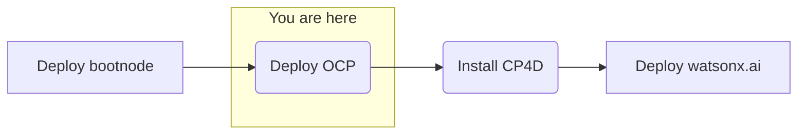

## Objective
Deploy watsonx.ai on self-managed AWS infrastructure forr customer software evaluation



## Milestones
1. Deploy and configuration of boot node to establish a beach-head into the Fidelity AWS environment
    - Complete
2. Deploy OCP using the documented UPI installation steps
    - In progress
3. Install CloudPak for Data
4. Deploy and configure watsonx.ai on self-managed AWS infrastructure

## Today's Accomplishments

### Validation of current deployment status
- Verify ‘quay.io’ is the registry in config.sh
    - Verified in the registry
- Add `/usr/local/bin` to `.bashrc` and `.bash_profile` for root
- Create a small instance on a different subnet, same VPC, and confirm that IP can be curled. Make require adjusting the Security Group rules for the bootnode. If 8080 fails, then HTTPD config will need be to changed to port 80 and service restarted
    - Initial onnectectivity over port 8080 failed
    - Fixed by opening port via security group
- Changed certificate organization (O) to match the domain
- Cert validated - current certificate using output of `openssl x509 -in /ibm/security/certs/ca.crt -text -noout`

    ```
    Issuer: C = US, O = ec2.internal, CN = CA
    Subject: C = US, O = ec2.internal, CN = CA
    ```
- Changed to

    ```
    Issuer: C = US, O = `customer domain name`, CN = CA
    Subject: C = US, O =  `customer domain name`, CN = CA
    ```
### Script Attempts
#### Cleanup Steps
- Remove metadata file from "wxai" directory
- Delete stacks created
- Ignore initial "FATAL" error logged
#### Attempt 1
- Running `create_cluster_step_1.sh` 
    - Applied required security tagging, as customer's security scans "remediate" (delete) improperly tagged items
    - Depoyment script changes 
        - Changed resource types and sizes. Example: `gp2 -> gpt3`
    - Renaming "bootnode" nomenclature to bastion host `bastion.'basedomain'`
    - Renamed certificate organization to match customer domain
- Reran create registry script
- Proceeded with DNS steps for new Elastic Load Balencer from prevous script
- Running `create_cluster_step_2.sh` 
    - Bootstrap Error
        ```
        Every Parameters object must contain a Type member
        An error occurred (ValidationError) when calling the DescribeStacks operation: Stack with id ibmwxai-6wvkv-bootstrap-stack does not exist
        ```
    - Solution - Needed to add Type string for parameter
        ```yaml
        BootstrapIgnitionLocation:
        Default: s3://my-s3-bucket/bootstrap.ign
        Description: Ignition config file location.
        Type: String ### This line was not here
        ```
#### Attempt 2
- AMI Error (repeat)
    - Cause: Customer security team denies all public AMI access
    - Fixed: Customer approved public AMI usage (for our specific AMI ID for the CoreOS)
#### Attempt 3
- yaml validation error (new)
    `Parameter validation failed: parameter value for parameter name Master1Subnet does not exist. Rollback requested by user`
    - Investigated why script is not generating parameter for `Master1Subnet`
    - Fix: Typo found in script create_control_plane_param.sh - masters1ubnet -> master1subnet
#### Attempt 4
- Notified of non-compliance during attempt via email from customer security to customer host
    1. Rule Formatting
        - Summary: Automated customer security scan "remediation" removed non-compliant security groups on bootstrap and master (Ingress and Egress)
        ```
        Security Event: Security Group with Unapproved Egress. The security group non-compliant egress rules have been deleted. Please check your application to ensure the functionality has not been negatively impacted.
        ```
        
        ```
        Security Event: Security Group with Unapproved Ingress. The security group non-compliant ingress rules have been deleted. Please check your application to ensure the functionality has not been negatively impacted.
        ```
        - LB template currently assuming public in sg-lb-template.yaml, bootstrap-template.yaml
        ```yaml
        CidrIp: 0.0.0.0/0
        ```
        - Fix: CidrIps need to be replaced with proper public format per customer security
        ```yaml
        # Replace all instances of 0.0.0.0/0 with
        CidrIp: 10.0.0.0/8
        ```
    2. Encryption Requirements
        - All volumes must be encrypted
        - Fix: Cloudforms template must be updated to create encrypted resources
#### Attempt 5
- Redeployment cleanup steps
- Running `create_cluster_step_1.sh` 
    - Successful
- Capture DNS output
- Add DNS output to config
- Running `create_cluster_step_1.sh` 
- Running `create_cluster_step_2.sh` 
    - Customer had a hard stop for the day. Awaiting feedback for next session

## Decisions and Action Items (DAI)
- Adding creation of the ssh key as root user on the bastion node
- CoreOS AMI approval from customer (Public AMI's are blocked)
    - AMI approved, step 2 script succeeded AMI portion
- Action Items: Customer security policies
    - Ongoing: Port rule formatting
        - Aligning to customer-determined security policies for port formating (Example: Using 10.0.0.0/8 instead of 0.0.0.0/0)
    - Cleared: Role authorizations
- Software evaluation licenses for CP4D and watsonx.ai
    - Pending IBM precurment team approval
- Potential Proxy Configuration Error
    - Prepared code changes for `create_cluster_step_2.sh` next session

## Next Steps
- License and configure Cloud Pak for Data
    - Cloud Pak Considerations
        - Security scans needed on container images 
        - Customer requires on-prem, offline install
        - Customer uses their own container registry that might introduce extra effort or compatability issues 
        - Version compatibility with OpenShift (e.g. 4.10 required and customer has 4.11) 
        - Supported storage not available 
        - Multiple cloudpaks on the same cluster 
        - custom connections to data sources not supported OOTB 
        - AWS-specific: IAM users required for install/deploy and are not allowed 
        - OpenShift specific: CoreOS requirement for control nodes 
        - Automatic updating of Cloud Pak, this can interrupt engagements (solution is to always remove update polling from operators)
        - Deploy watsonx.ai