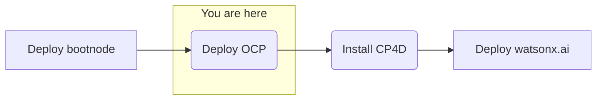

## Objective
Deploy watsonx.ai on self-managed AWS infrastructure forr customer software evaluation

## Milestones
1. Deploy and configuration of boot node to establish a beach-head into the Fidelity AWS environment
    - Complete
2. Deploy OCP using the documented UPI installation steps
    - In progress
3. Install CloudPak for Data
4. Deploy and configure watsonx.ai on self-managed AWS infrastructure

## Today's Accomplishments
### Summary
- Significant progress made in applying the required configurations according to the customer's environment policies 
- Master and Worker nodes responding

### Script Attempts
#### Cleanup Process
- Delete metadata file from "wxai" directory
- Delete stacks created by `create_cluster_step_2.sh` 
- Remove install state
- Ignore first "FATAL" error logged when running `create_cluster_step_2.sh` 
#### Attempt 1
- Communication Issues
    1. httpd not running on bootnode/bastion due to previous reboot
    - Fix: Enable httpd service on OS. Script change also made to force
    2. Egress rules added to bootnode and master
        - ALL AWS default egress connections needed to be manually configured to 10.0.0.0/8 vs AWS default value 0.0.0.0/0 for "all" traffic
#### Attempt 2
- Running OCP process manually (outside of script)
- Unable to pull images
    - Incorrectly pulling images from the bastion host, should be local registry
    - Temporary fix: Run `./start_registy.sh /ibm 5000`
    - Ignition configuration issue causing error
    - Fix: Add deleting state data to the cleanup process
#### Attempt 3
- Starting from scratch
- Running cleanup process
- Issue found in authentication configuration. The script is improperly configured to more than 1 authentication set
    - This customer deployment requires multiple authentication sets: quai.io, RedHat registry, Artifactory. Only one was tested
- Using workaround by manually adding the pullsecret to the create_install_config.sh
- Running `create_cluster_step_1.sh` 
    - Successful
- Updated LB DNS configurations manually (to be included in code changes, see Attempt 1)
- Running `create_cluster_step_2.sh` 
- Stalled - ignitions not firing
    - bootnode and master security group needed IP range (additonal egress configuration issues, added code changes, see Attempt 1)
- Error
    - Issue with Openshift installer extraction. For this customer case, we are not using local registry
    - Fix: Use general use OpenShift installer from Redhat, which does not assume local registry
#### Attempt 4
- Running cleanup process
- Running `create_cluster_step_2.sh`
- Updated LB DNS configurations
    -  Worker security group needed validIP range (addition to Attempt 1 and Attempt 2 egress issues, added code changes)
        - Replaced IP ranges `0-0` with `0-65535`
- Unable to use OpenShift API (oc command) to view pods due to use of untrusted certificates
    - Testing workaround use "insecure" connection by adding flag `--insecure-skip-tls-verify` when using oc 
    - Example `oc get pods -A --insecure-skip-tls-verify`
- Removed worker node external volumes (1tb) from script configuration
#### Attempt 5
- Retrying using default OpenShift Certificates (bypassing/not creating or using the CA certificate from documentation steps)
    - Updated config and removed certificate configuration
- Running cleanup process
- Running `create_cluster_step_2.sh`
- Witnessing certificate failures, but continueing install
- Error: Worker nodes not communicatting
- Fix:
    - Removed IPI artififact from script
    - Removed `{registry_url}` image content sources from imageContentSources (Airgap) from install config.sh
    - Removed fips mode from install config.sh
#### Attempt 6
- Running cleanup process
- Running additional cleanup steps:
    - Removed .kube
    - unset $KUBCONFIG
    - Delete ignition file
- Running `create_cluster_step_2.sh`
- Worker nodes responding
- Certificate error resolved
    - Potential root cause(s) (see fixes from Attempt 5)
        - IPI artififacts in script
        - `{registry_url}` image content sources from imageContentSources (Airgap) from install config.sh
        - fips mode from install config.sh
- Errors generated from OpenShift to be tracked in next flight log

## Decisions and Action Items (DAI)
- Software evaluation licenses for CP4D and watsonx.ai
    - Pending approval process 

## Next Steps
- License and configure Cloud Pak for Data
    - Cloud Pak Considerations
        - Security scans needed on container images 
        - Customer requires on-prem, offline install
        - Customer uses their own container registry that might introduce extra effort or compatability issues 
        - Version compatibility with OpenShift (e.g. 4.10 required and customer has 4.11) 
        - Supported storage not available 
        - Multiple cloudpaks on the same cluster 
        - custom connections to data sources not supported OOTB 
        - AWS-specific: IAM users required for install/deploy and are not allowed 
        - OpenShift specific: CoreOS requirement for control nodes 
        - Automatic updating of Cloud Pak, this can interrupt engagements (solution is to always remove update polling from operators)
- Deploy watsonx.ai
