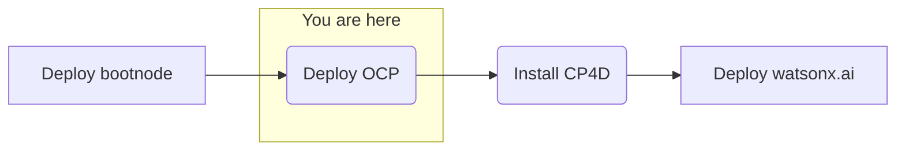

## Objective
Deploy watsonx.ai on self-managed AWS infrastructure forr customer software evaluation



## Milestones
1. Deploy and configuration of boot node to establish a beach-head into the customer AWS environment
    - Complete
2. Deploy OCP using the documented UPI installation steps
    - In progress
3. Install CloudPak for Data
4. Deploy and configure watsonx.ai on self-managed AWS infrastructure

## Today's Accomplishments
- Successful deployment of OpenShift
- Successful setup of storage class

### Summary
- Nodes were shut down after-hours by customer compliance automated scan
    - All nodes must be whitelisted by customer security
- Validating health of OCP installation
    - All nodes started and responding
    - Investigating pods
        - Some pods appear to be stuck due to node shutdowns
        - Deleting non-responsive pods
        - Replacing ICMP range 0 with all on 10.0.0.0/8
- Issue - `ConnectivityCheckController` is waiting for transition to desired version (4.12.8) to be completed.
    - Investigating proxy configuration
    - Adding cluster domain to proxy configuration - telling local nodes to not use proxy
- Fix: Adding noproxy spec to proxy configuration allowed for traffic locally (not through proxy) for nodes
- Waiting for configurations to apply (automatically)
- <strong>OCP cluster verified working</strong>
- Adding storage to cluster for CP4D support
    - Creating storage class
    ```
    # Requires kubeconfig
    oc new-project nfs-provisioner
    oc config set-context --current --namespace=nfs-provisioner
    ```
    ```
    helm repo add nfs-subdir-external-provisioner https://kubernetes-sigs.github.io/nfs-subdir-external-provisioner/
    helm install nfs-subdir-external-provisioner nfs-subdir-external-provisioner/nfs-subdir-external-provisioner \
        --namespace nfs-provisioner \
        --set nfs.server=<EFS URL> \
        --set nfs.path=/ \
        --set storageClass.defaultClass=true
    ```
    - Initial install - Local helm install needed
    - Retrying by retrieving the external provisioner and copying locally
    - Default storage class operational
    - Deleted test pod
    - Deleted pvx

## Lessons learned
### OCP Deployment
- Customer environment heavily affected configuration of the original deployment script and process
    - Security considerations
    - Proxy configurations in setup

## Decisions and Action Items (DAI)
- Software evaluation licenses for CP4D and watsonx.ai
- Customer decision is required to determine cluster console access
- Add documentation for the CP4D deployment

## Next Steps
- License and configure Cloud Pak for Data
    - Cloud Pak Considerations
        - Security scans needed on container images 
        - Customer requires on-prem, offline install
        - Customer uses their own container registry that might introduce extra effort or compatability issues 
        - Version compatibility with OpenShift (e.g. 4.10 required and customer has 4.11) 
        - Supported storage not available 
        - Multiple cloudpaks on the same cluster 
        - custom connections to data sources not supported OOTB 
        - AWS-specific: IAM users required for install/deploy and are not allowed 
        - OpenShift specific: CoreOS requirement for control nodes 
        - Automatic updating of Cloud Pak, this can interrupt engagements (solution is to always remove update polling from operators)
- Deploy watsonx.ai