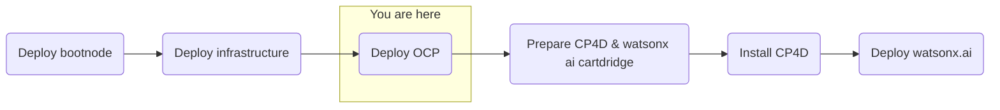

## Objective
Deploy watsonx.ai on self-managed AWS infrastructure for customer software evaluation

## Milestones
1. Deploy and configuration of boot node to establish a beach-head into the customer AWS environment
    - Complete
2. Deploy OCP using the documented UPI installation steps
    - Complete
3. Install Cloud Pak for Data
    - In Progress
4. Deploy and configure watsonx.ai on self-managed AWS infrastructure

## Today's Accomplishments
- Installed Cloud Pak for Data CLI on bastion host

### Summary
- Installed Cloud Pak for Data CLI on bastion host
- Attempting to resolve console URL from customer host (laptop), external to cluster and bastion
    - Customer is unable to add entries to Windows host file due to local administrator requirements
    - Adding hostname resolution for CP4D
- Customer doing offline
    - Adding resolvable URL for CP4D, allows for proper CP4D application communication (see Action Item)
        - Customer process - sending 'get' requests requires customer security approval process
    - Customer to follow 'multi object gateway' instructions
    - Customer to follow internal process for software trial evaluation, supporting documentation sent

## Decisions and Action Items (DAI)
- Software evaluation licenses for CP4D and watsonx.ai
- Customer decision is required to determine cluster console access

## Next Steps
- License and configure Cloud Pak for Data
    - Cloud Pak Considerations
        - Security scans needed on container images 
        - Customer requires on-prem, offline install
        - Customer uses their own container registry that might introduce extra effort or compatability issues 
        - Version compatibility with OpenShift (e.g. 4.10 required and customer has 4.11) 
        - Supported storage not available 
        - Multiple cloudpaks on the same cluster 
        - custom connections to data sources not supported OOTB 
        - AWS-specific: IAM users required for install/deploy and are not allowed 
        - OpenShift specific: CoreOS requirement for control nodes 
        - Automatic updating of Cloud Pak, this can interrupt engagements (solution is to always remove update polling from operators)
- Deploy watsonx.ai