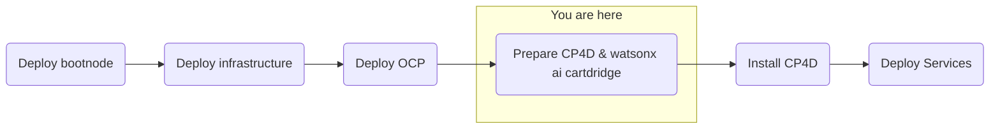

## Objective
Deploy watsonx.ai on self-managed AWS infrastructure for customer software evaluation

## Milestones
1. Deploy and configuration of boot node to establish a beach-head into the customer AWS environment
    - Complete
2. Deploy OCP using the documented UPI installation steps
    - Complete
3. Install Cloud Pak for Data
    - In Progress
4. Deploy and configure watsonx.ai on self-managed AWS infrastructure

## Today's Acomplishments
- Kublet configuration update applied
- Deployed instance of Multicloud Object Gateway

### Summary
- Reinstalled NFS provisioner (Helm)
- Installed OpenShift Data Foundation Operator
- Deployed MultiCloud Object Gateway
- OpenShift portal is active and cluster appears healthy
- Configuring CP4D CLI
- Awaiting for final cluster nodes to update through machine config pool

## Decisions and Action Items (DAI)
- Software evaluation awaiting customer's approval process. This blocks our ability to download software from cp.icr.io
    - Customer to escalate internally

## Lesons Learned
- Preparation for Cloud Pak for Data on OpenShift sizing needed to be adjusted to reflect an under-provisioning of CPU resources
    - This was resolved by..

## Next Steps
- License and configure Cloud Pak for Data
    - Cloud Pak Considerations
        - Security scans needed on container images 
        - Customer requires on-prem, offline install
        - Customer uses their own container registry that might introduce extra effort or compatability issues 
        - Version compatibility with OpenShift (e.g. 4.10 required and customer has 4.11) 
        - Supported storage not available 
        - Multiple cloudpaks on the same cluster 
        - custom connections to data sources not supported OOTB 
        - AWS-specific: IAM users required for install/deploy and are not allowed 
        - OpenShift specific: CoreOS requirement for control nodes 
        - Automatic updating of Cloud Pak, this can interrupt engagements (solution is to always remove update polling from operators)
- Deploy watsonx.ai