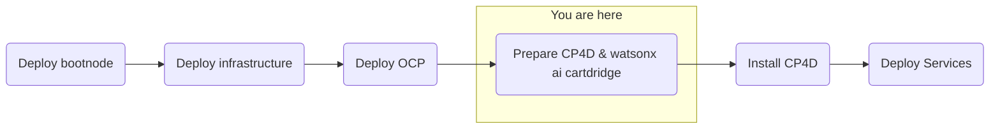

## Objective
Deploy watsonx.ai on self-managed AWS infrastructure for customer software evaluation

## Milestones
1. Deploy and configuration of boot node to establish a beach-head into the customer AWS environment
    - Complete
2. Deploy OCP using the documented UPI installation steps
    - Complete
3. Install Cloud Pak for Data
    - In Progress
4. Deploy and configure watsonx.ai on self-managed AWS infrastructure on ref environment and document
    - In Progress

### Summary
- Customer has approved required contracts and procedures have been followed to attain an entitlement key.

## Decisions and Action Items (DAI)
- Customer has worked with us to spin up a new cluster
    - Previous cluster had been deleted to save AWS credits
    - IBM to provide tighter instruction for the deployment of CP4D
- Customer received a GPU reservation
    - GPU node has been ordered and deployed
    - Costs associated with GPU resources are discounted, but the meter is running once the reservation is accepted.

## Lessons Learned
- watsonx.ai service requires larger local disks on worker nodes (500Gb)
- The GPU node required for watsonx.ai seems to be a limited resource
- Had to replace the nodes in the cluster as the attached disks were incorrect

## Next Steps
- License and configure Cloud Pak for Data
    - Cloud Pak Considerations
        - Security scans needed on container images 
        - Customer requires on-prem, offline install
        - Customer uses their own container registry that might introduce extra effort or compatability issues 
        - Version compatibility with OpenShift (e.g. 4.10 required and customer has 4.11) 
        - Supported storage not available 
        - Multiple cloudpaks on the same cluster 
        - custom connections to data sources not supported OOTB 
        - AWS-specific: IAM users required for install/deploy and are not allowed 
        - OpenShift specific: CoreOS requirement for control nodes 
        - Automatic updating of Cloud Pak, this can interrupt engagements (solution is to always remove update polling from operators)
- Deploy watsonx.ai