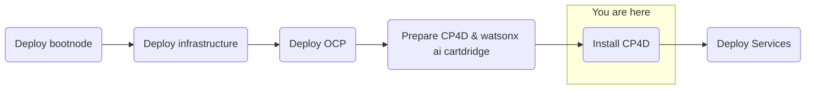

## Objective
Deploy watsonx.ai on self-managed AWS infrastructure for customer software evaluation




## Milestones
1. Deploy and configuration of boot node to establish a beach-head into the customer AWS environment
    - Complete
2. Deploy OCP using the documented UPI installation steps
    - Complete
3. Install Cloud Pak for Data
    - In Progress
4. Deploy and configure watsonx.ai on self-managed AWS infrastructure on ref environment and document
    - In Progress

### Today's Accomplishments
- Successful deployment of CP4D

### Summary
- Customer has approved required contracts and procedures have been followed to attain an entitlement key.

## Decisions and Action Items (DAI)
- MCG Secrets created for Cloud Pak components
- Authorized Instance Topology
- Installed Cloud Pak shared components
- Installed Knative

## Lessons Learned
- Had an issue with “apply-cluster-components” which requires connecting to github to download CASE files. Found a solution in the cpd-cli documentation: use two additioanl flags on the command “--case_download=true” and  “--from_oci=true” which tells cpd-cli to download the CASE files from IBM Open Container Initiative instead of github.
- While running “setup-instance-topology” for knative, received an error regarding storage. Added ``` “--block_storage_class=${STG_CLASS_BLOCK}” ``` to the command and it completed successfully.

## Next Steps
- License and configure Cloud Pak for Data
    - Cloud Pak Considerations
        - Security scans needed on container images 
        - Customer requires on-prem, offline install
        - Customer uses their own container registry that might introduce extra effort or compatability issues 
        - Version compatibility with OpenShift (e.g. 4.10 required and customer has 4.11) 
        - Supported storage not available 
        - Multiple cloudpaks on the same cluster 
        - custom connections to data sources not supported OOTB 
        - AWS-specific: IAM users required for install/deploy and are not allowed 
        - OpenShift specific: CoreOS requirement for control nodes 
        - Automatic updating of Cloud Pak, this can interrupt engagements (solution is to always remove update polling from operators)
- Deploy watsonx.ai