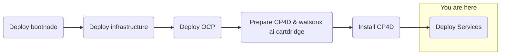

## Objective
Deploy watsonx.ai on self-managed AWS infrastructure for customer software evaluation

## Milestones
1. Deploy and configuration of boot node to establish a beach-head into the customer AWS environment
    - Complete
2. Deploy OCP using the documented UPI installation steps
    - Complete
3. Install Cloud Pak for Data
    - Complete
4. Deploy and configure watsonx.ai on self-managed AWS infrastructure on ref environment and document
    - In Progress

### Today's Accomplishments
- Successful installation of watsonx Discovery
- Successful installation of watson Studio
- Successful installation of watson Machine Learning
- Successful installation of IBM Knowledge Catalog

### Summary
- Trobuleshooting watsonx Assistant installation pods
    - Starting required pods/containers

## Decisions and Action Items (DAI)
- None today

## Lessons Learned
- None today

## Next Steps
- Deploy watsonx.ai
- Application configurations
- Application validations