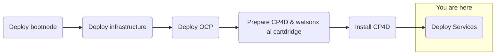

## Objective
Deploy watsonx.ai on self-managed AWS infrastructure for customer software evaluation

## Milestones
1. Deploy and configuration of boot node to establish a beach-head into the customer AWS environment
    - Complete
2. Deploy OCP using the documented UPI installation steps
    - Complete
3. Install Cloud Pak for Data
    - Complete
4. Deploy and configure watsonx.ai on self-managed AWS infrastructure on ref environment and document
    - In Progress

### Today's Accomplishments

### Summary
- Provisioning GPU node
    - Installing GPU operator
- Installing watsonx.ai operator
    - Waiting on the installer

## Decisions and Action Items (DAI)
- MCG Secrets created for Cloud Pak components
- Authorized Instance Topology
- Installed Cloud Pak shared components
- Installed Knative
- GPU Node Activity and Billing

## Lessons Learned
- GPU Node Activity
    - AWS was charging for a GPU Node while powered-down
    - Provisioned the GPU Node using a reserve instance (30 days starting May 6)

## Next Steps
- Deploy watsonx.ai
- Install NeuralSeek