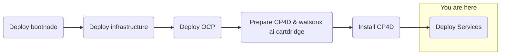

## Objective
Deploy watsonx.ai on self-managed AWS infrastructure for customer software evaluation



## Milestones
1. Deploy and configuration of boot node to establish a beach-head into the customer AWS environment
    - Complete
2. Deploy OCP using the documented UPI installation steps
    - Complete
3. Install Cloud Pak for Data
    - Complete
4. Deploy and configure watsonx.ai on self-managed AWS infrastructure on ref environment and document
    - In Progress


### Today's Accomplishments
- Successful installation of Llama model

### Summary
- Installing and troubleshooting remaining LLMs for watsonx.ai
    - Granite model installed (previous session)
    - Issues with installation of Mistral and Llama models
        - Investigating Mistral model compatibility
            - Determined incompatible with p4d.24xlarge a100-40gb
        - Investigating work around for instance type compatability for Llama model p4d.24xlarge a100-40gb in US-East-2
- Llama installed and running using workaround (Workaround source https://github.ibm.com/NGP-TWC/ml-planning/issues/37189)
    ```yaml
    #Add the following to watsonxaiifm-cr:
    meta_llama_llama_2_70b_chat:
    deployment_yaml_name: llama-2-70b-chat.yaml.j2
    pvc_name: meta-llama-llama-2-70b-chat-pvc
    svc_name: llama-2-70b-chat
    pvc_size: 150Gi
    dir_name: models--meta-llama--llama-2-70b-chat
    model_name: /watsonxaiifm-models/models--meta-llama--llama-2-70b-chat
    cuda_visible_devices: 0,1,2,3,4,5,6,7
    model_root_dir: /watsonxaiifm-models
    flash_attention: true
    deployment_framework: hf_custom_tp
    dtype_str: float16
    max_batch_size: 128
    max_concurrent_requests: 160
    max_batch_weight: 200000
    max_sequence_length: 4096
    max_prefill_weight: 60000
    max_new_tokens: 4096
    num_shards: 8
    hf_modules_cache: /tmp/huggingface/modules
    force_apply: no
    meta_llama_llama_2_70b_chat_resources:
    limits:
    cpu: “8”
    memory: 246Gi
        nvidia.com/gpu: “8"
    ephemeral-storage: 1Gi
    requests:
    cpu: “1”
    memory: 240Gi
        nvidia.com/gpu: “8"
    ephemeral-storage: 10Mi
    ```
    ```yaml
    #Add the following to watsonxai-cr:
    tuning_disabled: true
    ```

## Decisions and Action Items (DAI)
- Mistral installation
    - Incompatable with a100-40gb

## Lessons Learned
- LLM model compatabilities with provisioned resources
    - Most IBM LLM's require a100-80gb
## Next Steps
- Deploy watsonx.ai
- Install NeuralSeek