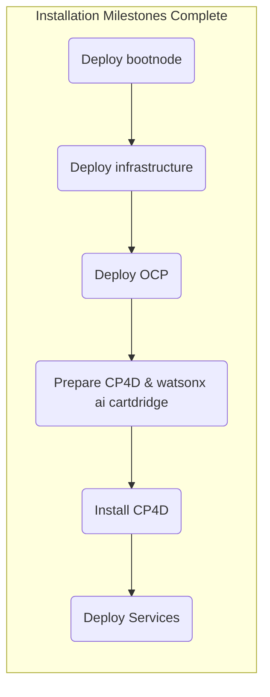

## Objective
Deploy watsonx.ai on self-managed AWS infrastructure for customer software evaluation



## Milestones
1. Deploy and configuration of boot node to establish a beach-head into the customer AWS environment
    - Complete
2. Deploy OCP using the documented UPI installation steps
    - Complete
3. Install Cloud Pak for Data
    - Complete
4. Deploy and configure watsonx.ai on self-managed AWS infrastructure on ref environment and document
    - In Progress


### Today's Accomplishments
- Installed NeuralSeek
- Installed watsonx Orchestrate

### Summary
- Installing NeuralSeek
- S3 Bucket Configured
- Installing watsonx Orchestrate
    - Removing/recreating MongoDB pod
    - Applied required patch from 'known issues' list (IBM internal documentation)
            ```shell
            INSTANCE_NAME=$(oc -n <cpd-namespace> get wa --output jsonpath='{.items[0].metadata.name}')
            ```
            ```shell
            oc patch wa ${INSTANCE_NAME} --type='merge' -p='{"configOverrides":{"store":{"extra_vars": {"store": {"MAX_NEW_IA_ASSISTANTS":"1000","MAX_NEW_IA_SKILLS":"300000","ASSISTANT_MAX_PAGE_LIMIT":"1000"}}}}}'
            ```

## Decisions and Action Items (DAI)
- None pending

## Lessons Learned
- None today

## Next Steps
- Application configuration
    - NeuralSeek
    - watsonx.ai Prompt Lab
    - watsonx Assistant
    - watsonx Orchestrate
        - ServiceNow skills
        - Microsoft Outlook skills