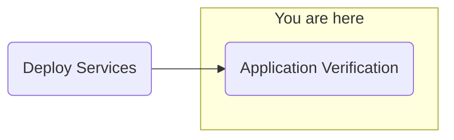

## Objective
Deploy watsonx.ai on self-managed AWS infrastructure for customer software evaluation

## Milestones
1. Deploy and configuration of boot node to establish a beach-head into the customer AWS environment
    - Complete
2. Deploy OCP using the documented UPI installation steps
    - Complete
3. Install Cloud Pak for Data
    - Complete
4. Deploy and configure watsonx.ai on self-managed AWS infrastructure on ref environment and document
    - In Progress

### Summary
- Investigating NeuralSeek configuration
    - Curl request from application and bastion failing
    - Nodes missing machineconfigs, waiting for machineconfigs to propegate through all nodes

## Decisions and Action Items (DAI)
- None pending

## Lessons Learned
- None today

## Next Steps
- Application validation
    - NeuralSeek
    - watsonx Assistant
    - watsonx Orchestrate
        - ServiceNow skills
        - Microsoft Outlook skills