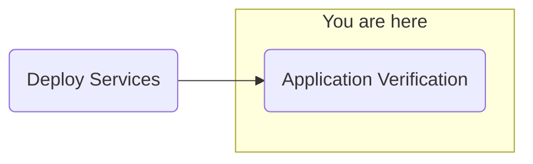

## Objective
Deploy watsonx.ai on self-managed AWS infrastructure for customer software evaluation



## Milestones
1. Deploy and configuration of boot node to establish a beach-head into the customer AWS environment
    - Complete
2. Deploy OCP using the documented UPI installation steps
    - Complete
3. Install Cloud Pak for Data
    - Complete
4. Deploy and configure watsonx.ai on self-managed AWS infrastructure on ref environment and document
    - In Progress

### Summary
- Continuing to investigate NeuralSeek configuration / CP4D
    - Reset all pods that are used in the CP4D login flow using the following commands:
            ```shell
            oc delete pod -n cpd -l component=ibm-nginx
            ```
            ```shell
            oc delete pod -n cpd -l component=usermgmt
            ```
            ```shell
            oc delete pod -n cpd -l component=zen-core
            ```
            ```shell
            oc delete pod -n cpd -l component=zen-core-api
            ```
    - Confirmed metastore-db is also healthy using this command:
            ```shell
            oc get cluster.postgresql.k8s.enterprisedb.io zen-metastore-edb -n cpd
            ```
    - Still unable to login and browse CP4D consistently
    - Errors found in usermgmt pods that appear after failed page loads in CP4D
    - Successful use of APIs to query CP4D for a Bearer Token, to list project IDs, and to even generate text from WatsonX
    - Neuralseek was able to query WatsonX, however it couldnt interact with Watson Discovery.
    - Support ticket was opened previously, updated this morning to include screenshots of the error logs found in usermgmt pods. Ticket has been upgraded to Sev1
    - Pods verified
    - Engaging support

## Decisions and Action Items (DAI)
- None pending

## Lessons Learned
- None today

## Next Steps
- Application validation
    - watsonx Orchestrate