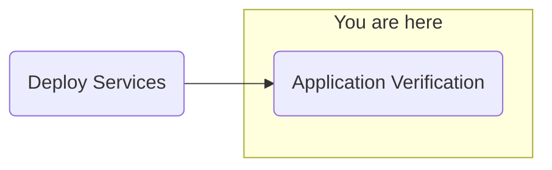

## Objective
Deploy watsonx.ai on self-managed AWS infrastructure for customer software evaluation



## Milestones
1. Deploy and configuration of boot node to establish a beach-head into the customer AWS environment
    - Complete
2. Deploy OCP using the documented UPI installation steps
    - Complete
3. Install Cloud Pak for Data
    - Complete
4. Deploy and configure watsonx.ai on self-managed AWS infrastructure on ref environment and document
    - In Progress

### Summary
- Continuing to investigate NeuralSeek configuration / CP4D
    - Support team reviewing CP4D install and connectivity
    - Potential issues found on customer network blocking API connectivity
            Run port forward service on port 8888
            ```shell
            oc port-forward service/ibm-nginx-svc 8888:443
            ```
            From a new terminal on the same node:
            ```shell
            ss -tlnp
            ```
            Verified 8888 listenting on localhost
            ```shell
            # Custom support js
            curl -k -LO https://127.0.0.1:8888/common-nav/api/nls/login-nls.js
            ```
            Output shows Pod recieving required files 
            Something in between the pods that disallows authenticated traffic 
    - Customer to engage network team to assess / log network traffic via AWS
- Issue resolved
    - There were eronious EC2 instances in the AWS load balencer from previous configurations that interfered with cluster communication
    - Issue was not constant and only appeared when network traffic was sent to an incorrect destination (non-existant) by the load balencer
- Ready to continue application verification

## Decisions and Action Items (DAI)
- None pending

## Lessons Learned
- Cleaning previous networking configurations

## Next Steps
- Application configuration
    - NeuralSeek
    - watsonx.ai Prompt Lab
    - watsonx Assistant
    - watsonx Orchestrate
        - ServiceNow skills
        - Microsoft Outlook skills