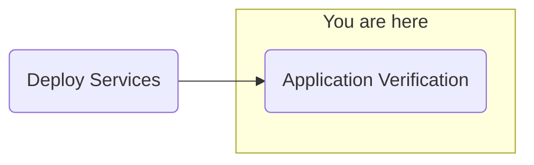

## Objective
Deploy watsonx.ai on self-managed AWS infrastructure for customer software evaluation

## Milestones
1. Deploy and configuration of boot node to establish a beach-head into the customer AWS environment
    - Complete
2. Deploy OCP using the documented UPI installation steps
    - Complete
3. Install Cloud Pak for Data
    - Complete
4. Deploy and configure watsonx.ai on self-managed AWS infrastructure on ref environment and document
    - In Progress

### Summary
- Testing NeuralSeek functionality
- NeuralSeek verified opperational
- Configuring watsonx Assistant ServiceNow extension
    - Unable to access ServiceNow, getting blocked outbound
    - Investigating AWS and Cluster network connectivity
        - Curl requests working from bastion, not from application or cluster
    - Issue found: Customer proxy needs to be used in all API requests (even though cluster is configured to use proxy)
        - Proposed workaround: Add proxy to OpenAPI spec for watsonx Assistant and Orchestrate

## Decisions and Action Items (DAI)
- None pending

## Lessons Learned
If customer has a proxy, the proxy configuration needs to be used in all API requests (even though cluster is configured to use proxy) on watsonx Orchestrate and Assistant.

## Next Steps
- Application validation
    - watsonx Assistant
    - watsonx Orchestrate