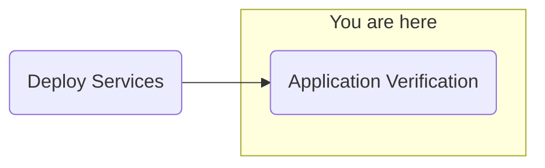

## Objective
Deploy watsonx.ai on self-managed AWS infrastructure for customer software evaluation

## Milestones
1. Deploy and configuration of boot node to establish a beach-head into the customer AWS environment
    - Complete
2. Deploy OCP using the documented UPI installation steps
    - Complete
3. Install Cloud Pak for Data
    - Complete
4. Deploy and configure watsonx.ai on self-managed AWS infrastructure on ref environment and document
    - In Progress

### Summary
- TS016344977 opened to IBM support to investigate watson discovery EDB cluster issue
    - Watson Discovery has an EDB cluster that has only 1/2 pods running, with one pod stuck in CrashLoopBackoff
- Configuring NeuralSeek
    - Adding content to the AWS storage for NeuralSeek access

## Decisions and Action Items (DAI)
- None pending

## Lessons Learned
- None today

## Next Steps
- Proxy configuration testing
- Application validation
    - watsonx Assistant
    - watsonx Orchestrate