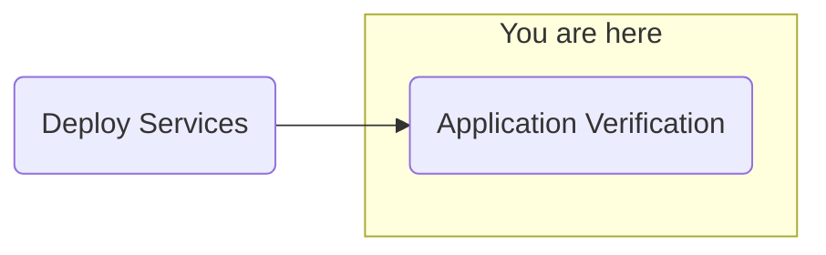

## Objective
Deploy watsonx.ai on self-managed AWS infrastructure for customer software evaluation



## Milestones
1. Deploy and configuration of boot node to establish a beach-head into the customer AWS environment
    - Complete
2. Deploy OCP using the documented UPI installation steps
    - Complete
3. Install Cloud Pak for Data
    - Complete
4. Deploy and configure watsonx.ai on self-managed AWS infrastructure on ref environment and document
    - In Progress

### Today's Accomplishments
- Successful configuration of wastsonx Assistant with PDF lookups
- Successful validation of NeuralSeek souce attribution

### Summary
- TS016344977 opened with IBM support to investigate watson discovery EDB cluster issue
    - Watson Discovery has an EDB cluster that has only 1/2 pods running, with one pod stuck in CrashLoopBackoff
    - Troubleshooting with support
    - Support identified an issue with the Postgress Database
        - Postgress database not running putting the cluster in an unhealthy state
            ```
            {"level": "info", "ts":"2024-05-29119:39:062", "logger": "pg_rewind", "msg": "pg_rewind: connected to server", "pipe": "stderr", "logging-pod": "wd-discovery-cn-postgres-1"}
            ```
            ```
            {"level": "info", "ts":"2024-05-29119:39:062", "logger": "pq rewind", "msg": "pg_rewind: fatal: target server must be shut down cleanly" "pipe":"stderr" "logging_pod": "wd-discovery-cn-postqres-1"}
            ```
        - Engaging Postgress support
- Continuing watsonx Assistant configuration
    - Hosting response PDFs on the bastion httpd server
    - wastsonx Assistant with PDF lookup configured 
- Continuing NeuralSeek configuration
    - Test questions verified
- Retrying ServiceNow Skills
    - Configuring proxy in the skill yaml/json
    - Same timeout error when trying skill, continuing investigation

## Decisions and Action Items (DAI)
- ServiceNow connectivity being investigated
    - Issue with proxy configuration not allowing watsonx Assistant/Orchestrate communication with ServiceNow.com

## Lessons Learned
- pdf files needed for watson Assistant extensions available to the cluster internally (no external access or configurable access to S3 buckets)
    - Workaround: Hosted pdf files on the bastion httpd server (originally used for the OCP ignition files)

## Next Steps
- Application configuration
    - watsonx.ai Prompt Lab
    - watsonx Assistant
    - watsonx Orchestrate
        - ServiceNow skills
        - Microsoft Outlook skills