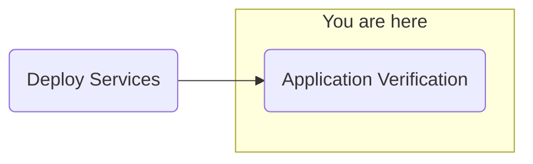

## Objective
Deploy watsonx.ai on self-managed AWS infrastructure for customer software evaluation



## Milestones
1. Deploy and configuration of boot node to establish a beach-head into the customer AWS environment
    - Complete
2. Deploy OCP using the documented UPI installation steps
    - Complete
3. Install Cloud Pak for Data
    - Complete
4. Deploy and configure watsonx.ai on self-managed AWS infrastructure on ref environment and document
    - In Progress

### Summary
- Attempting proxy reconfiguration for the cluster
        ```shell
        # Customer data redacted
        kubectl get pods -n cpd -o json | jq -r ‘.items[].metadata.labels[“app.kubernetes.io/instance”]’ | sort | uniq
        cpd-cli manage enable-rsi --cpd_instance_ns=${PROJECT_CPD_INST_OPERANDS}
        cat << EOF >> cpfs-proxy-envs.json
        [ {
            “name”:  “HTTP_PROXY”,
            “value”: “http://http.proxy.customer.com:8000/”
        }, {
            “name”:  “http_proxy”,
            “value”: “http://http.proxy.customer.com:8000/”
        }, {
            “name”:  “HTTPS_PROXY”,
            “value”: “http://http.proxy.customer.com:8000/”
        }, {
            “name”:  “https_proxy”,
            “value”: “http://http.proxy.customer.com:8000/”
        }, {
            “name”:  “NO_PROXY”,
            “value”: “.aws-nonprod.xxx.com,.ibm-wxai.aws-nonprod.customer.com.apps.ibm-wxai.aws-nonprod.xxx.com,172.30.0.0/16,10.128.0.0/14,10.19.170.0/25”
        }, {
            “name”:  “no_proxy”,
            “value”: “.aws-nonprod.xxx.com,.ibm-wxai.aws-nonprod.customer.com.apps.ibm-wxai.aws-nonprod.xxx.com,172.30.0.0/16,10.128.0.0/14,10.19.170.0/25”
        } ]
        EOF
        cpd-cli manage create-rsi-patch \
            --cpd_instance_ns=cpd \
            --patch_name=“cpfs-proxy” \
            --description=“add proxy settings to CPD” \
            --patch_type=rsi_pod_env_var \
            --patch_spec=/tmp/work/rsi/cpfs-proxy-envs.json \
            --spec_format=set-env \
            --select_all_pods=true \
            --include_labels=wa \
            --exclude_labels=app:rsi \
            --skip_apply=false \
            --state=active
        ```
    - New configuration requires watsonx Assistant pod reboot, waiting until after further application configurations
    - Continuing to configure NeuralSeek assistant

## Decisions and Action Items (DAI)
- ServiceNow connectivity being investigated
    - Issue with proxy configuration not allowing watsonx Assistant/Orchestrate communication with ServiceNow.com

## Lessons Learned
- pdf files needed for watson Assistant extensions available to the cluster internally (no external access or configurable access to S3 buckets)
    - Workaround: Hosted pdf files on the bastion httpd server (originally used for the OCP ignition files)

## Next Steps
- Application configuration
    - watsonx.ai Prompt Lab
    - watsonx Assistant
    - watsonx Orchestrate
        - ServiceNow skills
        - Microsoft Outlook skills