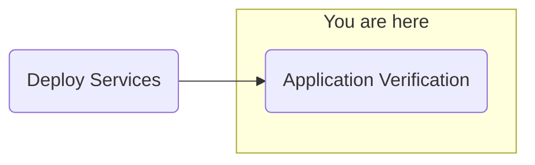

## Objective
Deploy watsonx.ai on self-managed AWS infrastructure for customer software evaluation

## Milestones
1. Deploy and configuration of boot node to establish a beach-head into the customer AWS environment
    - Complete
2. Deploy OCP using the documented UPI installation steps
    - Complete
3. Install Cloud Pak for Data
    - Complete
4. Deploy and configure watsonx.ai on self-managed AWS infrastructure on ref environment and document
    - In Progress

### Today's Accomplishments

### Summary
- Brief watsonx.ai Prompt Lab demonstration
- Reconfiguring watsonx Assistant front end (per customer request, to be worked on)
- Continuing proxy investigation for the cluster
    - Applying patch to set environment variables for the pods via RSI patch [IBM documentation here](https://www.ibm.com/docs/en/cloud-paks/cp-data/4.8.x?topic=2-customizing-pod-specifications-rsi)

## Decisions and Action Items (DAI)
- ServiceNow connectivity being investigated
    - Issue with proxy configuration not allowing watsonx Assistant/Orchestrate communication with ServiceNow.com
- watsonx Assistant front-end enhancements with customer
    - Chat greeting enhancements

## Lessons Learned
- pdf files needed for watson Assistant extensions available to the cluster internally (no external access or configurable access to S3 buckets)
    - Workaround: Hosted pdf files on the bastion httpd server (originally used for the OCP ignition files)

## Next Steps
- Application configuration
    - watsonx.ai Prompt Lab
    - watsonx Assistant
    - watsonx Orchestrate
        - ServiceNow skills
        - Microsoft Outlook skills