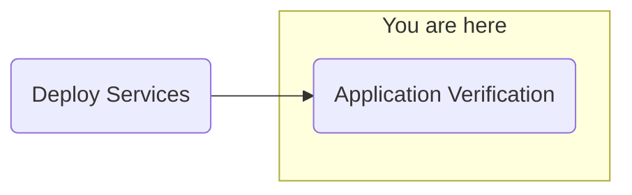

## Objective
Deploy watsonx.ai on self-managed AWS infrastructure for customer software evaluation

## Milestones
1. Deploy and configuration of boot node to establish a beach-head into the customer AWS environment
    - Complete
2. Deploy OCP using the documented UPI installation steps
    - Complete
3. Install Cloud Pak for Data
    - Complete
4. Deploy and configure watsonx.ai on self-managed AWS infrastructure on ref environment and document
    - In Progress

### Today's Accomplishments
- Further configuration of watsonx Assistant

### Summary
- Pivoting from external integrations 
    - Unable to configure proxy to reach out to external sites from OCP
- Continuing configuration of assistant actions and non-extenral connections
    - Assistant configured
- Continuing configuration of NeuralSeek

## Decisions and Action Items (DAI)
- Investigation of cluster proxy configuration (post POC)
- Provide a demonstration of ServiceNow/Outlook integration via Orchestrate and Assistant

## Lessons Learned
- Proxy configuration for cluster required for application access to external sources - To be investigated post-POC

## Next Steps
- Application verification