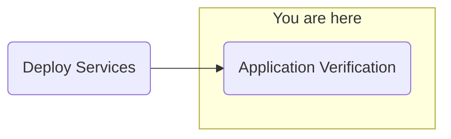

## Objective
Deploy watsonx.ai on self-managed AWS infrastructure for customer software evaluation

## Milestones
1. Deploy and configuration of boot node to establish a beach-head into the customer AWS environment
    - Complete
2. Deploy OCP using the documented UPI installation steps
    - Complete
3. Install Cloud Pak for Data
    - Complete
4. Deploy and configure watsonx.ai on self-managed AWS infrastructure on ref environment and document
    - In Progress

### Today's Accomplishments
- Further configuration of watsonx Assistant

### Summary
- Configuring NeuralSeek
    - Error occuring during testing "Error, please refresh the page and try again"
        - Issue found - old API key being used in the configuration due to unexpected API key retainment in configuration output for customer
- Issue has been resolved, continuing configuration of NeuralSeek

## Decisions and Action Items (DAI)
- Investigation of cluster proxy configuration (post POC)
- Provide a demonstration of ServiceNow/Outlook integration via Orchestrate and Assistant

## Lessons Learned
- In NeuralSeek, the API key is retained in configuration exports. The latest configuration had an old key

## Next Steps
- Application verification